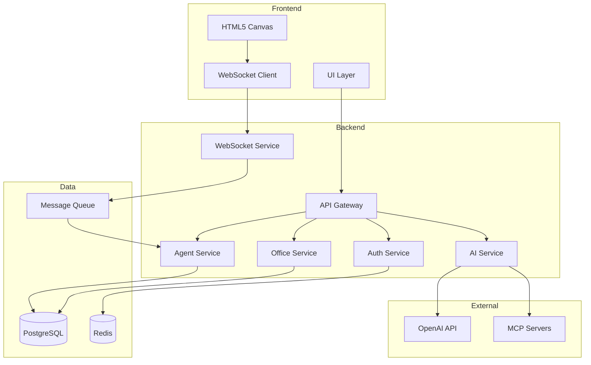
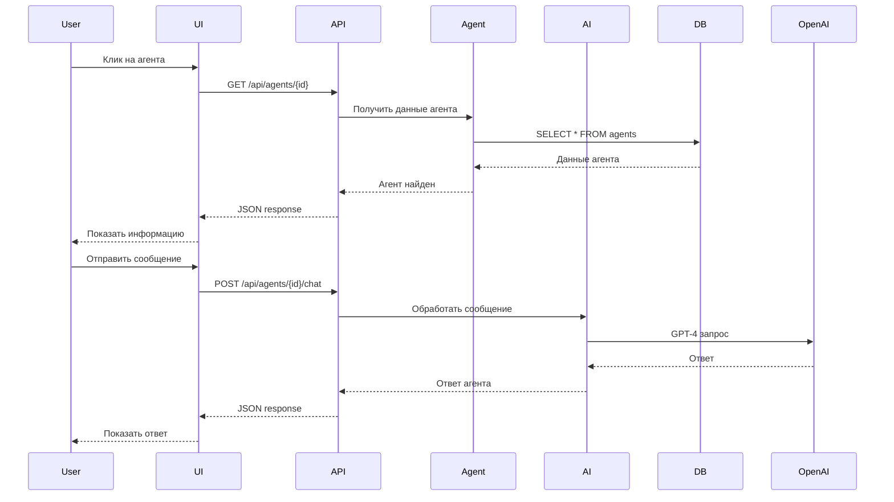
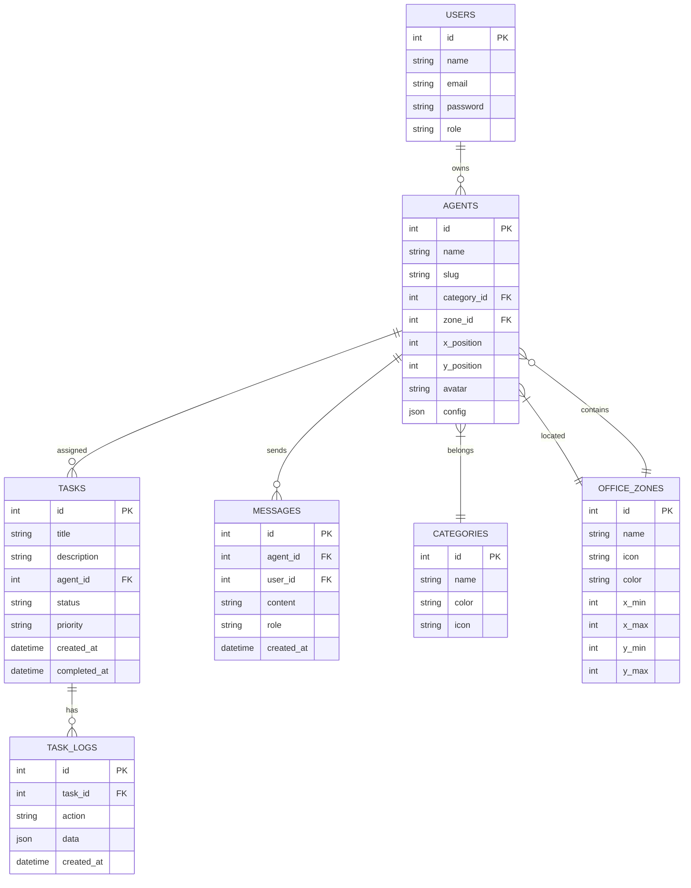
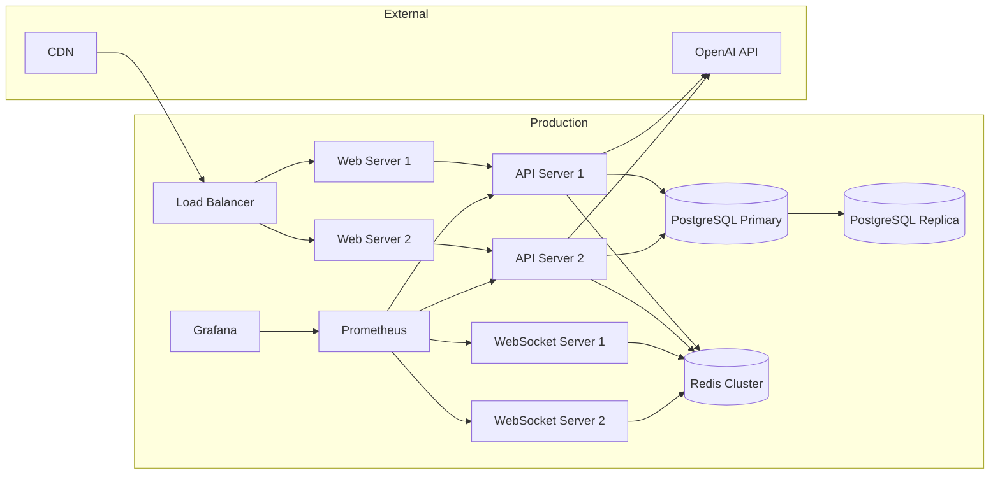
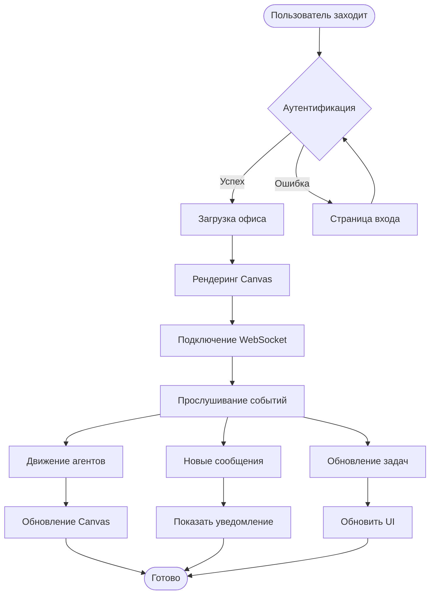
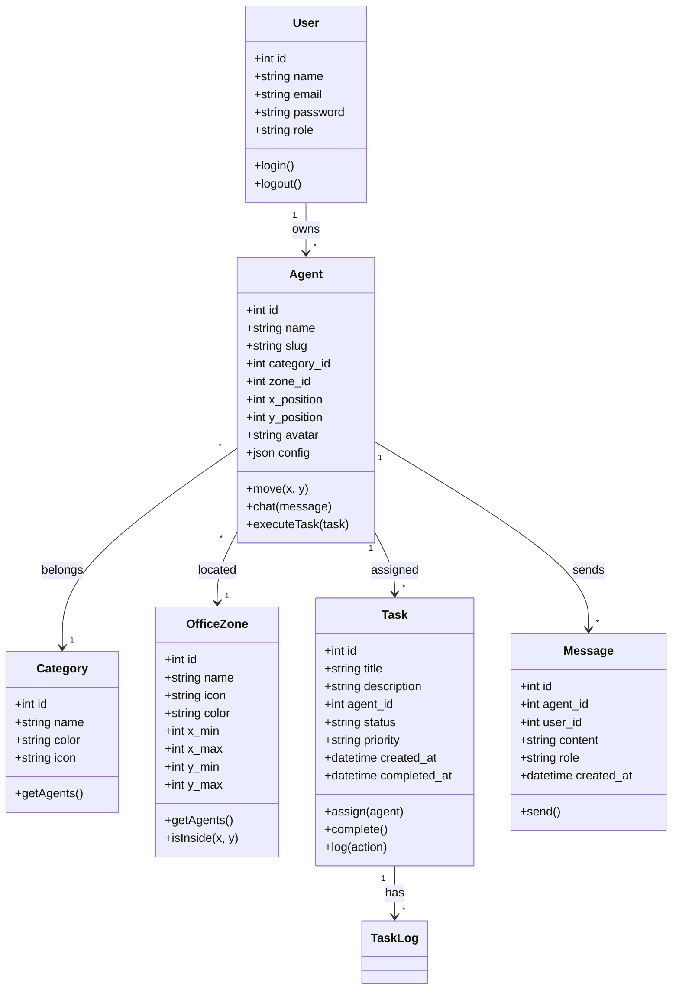
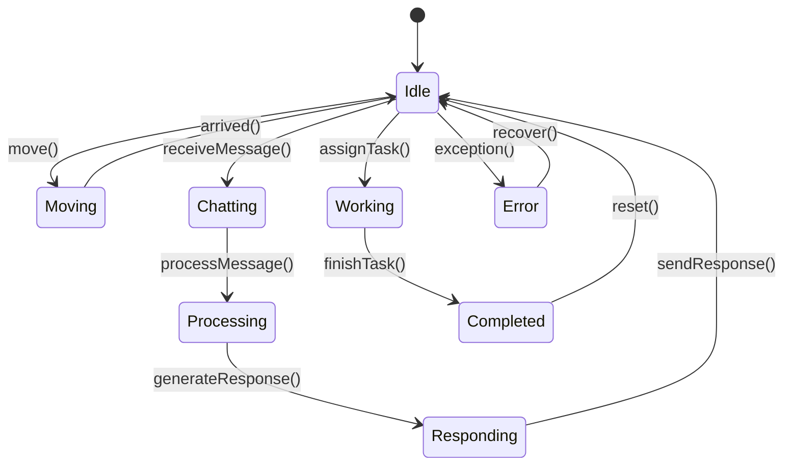
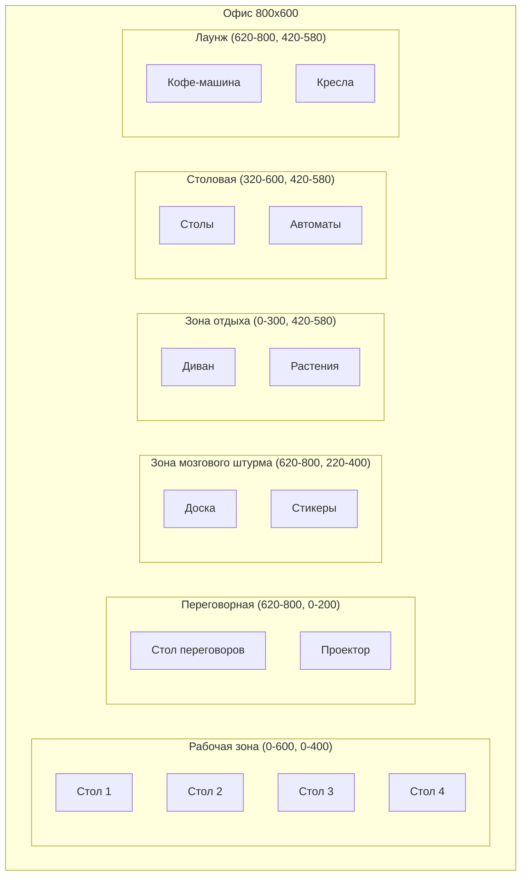
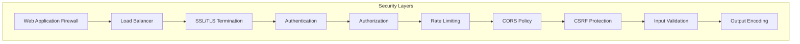

# 🏗️ Фаза 1: Архитектурная диаграмма

**Агент**: @software-architect  
**Дата**: 2026-03-31  
**Статус**: ✅ Завершено

---

## 📊 Диаграмма компонентов



---

## 📊 Диаграмма последовательности



---

## 📊 Диаграмма базы данных



---

## 📊 Диаграмма развертывания



---

## 📊 Диаграмма потока данных



---

## 📊 Диаграмма классов



---

## 📊 Диаграмма состояний агента



---

## 📊 Диаграмма офиса



---

## 📊 Диаграмма API

```mermaid
graph LR
    subgraph "API Endpoints"
        GET_agents[GET /api/agents]
        GET_agent[GET /api/agents/{id}]
        POST_agent[POST /api/agents]
        PUT_agent[PUT /api/agents/{id}]
        DELETE_agent[DELETE /api/agents/{id}]

        GET_tasks[GET /api/tasks]
        POST_task[POST /api/tasks]
        PUT_task[PUT /api/tasks/{id}]

        GET_messages[GET /api/messages]
        POST_message[POST /api/messages]

        GET_office[GET /api/office]
        PUT_office[PUT /api/office]

        WS_agents[WS /ws/agents]
        WS_office[WS /ws/office]
    end
```

---

## 📊 Диаграмма безопасности



---

## 📚 Дополнительные ресурсы

- [Отчёт об аудите](PHASE1_AUDIT_REPORT.md)
- [Техническое задание](PHASE1_TECHNICAL_SPECIFICATION.md)
- [План разработки](VIRTUAL_2D_OFFICE_DEVELOPMENT_PLAN.md)

---

**Создано**: 2026-03-31  
**Агент**: @software-architect  
**Статус**: ✅ Завершено
