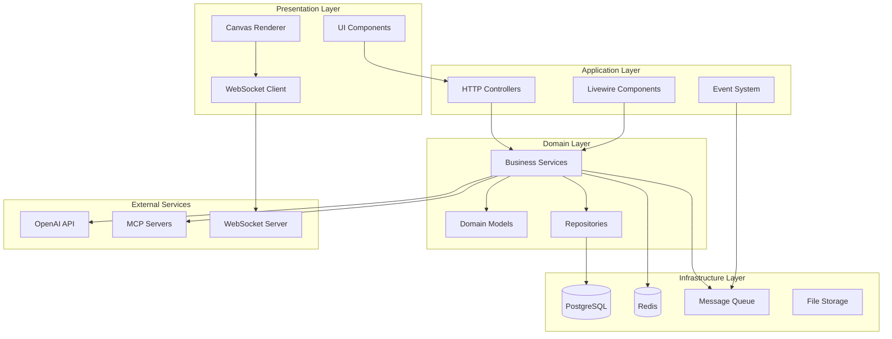
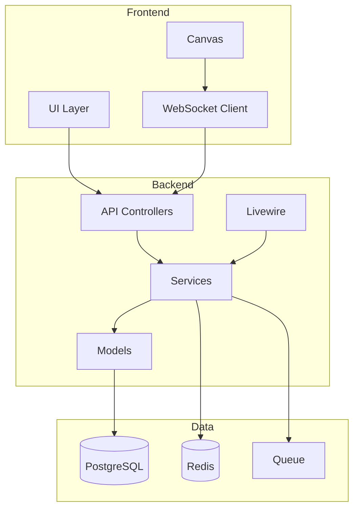
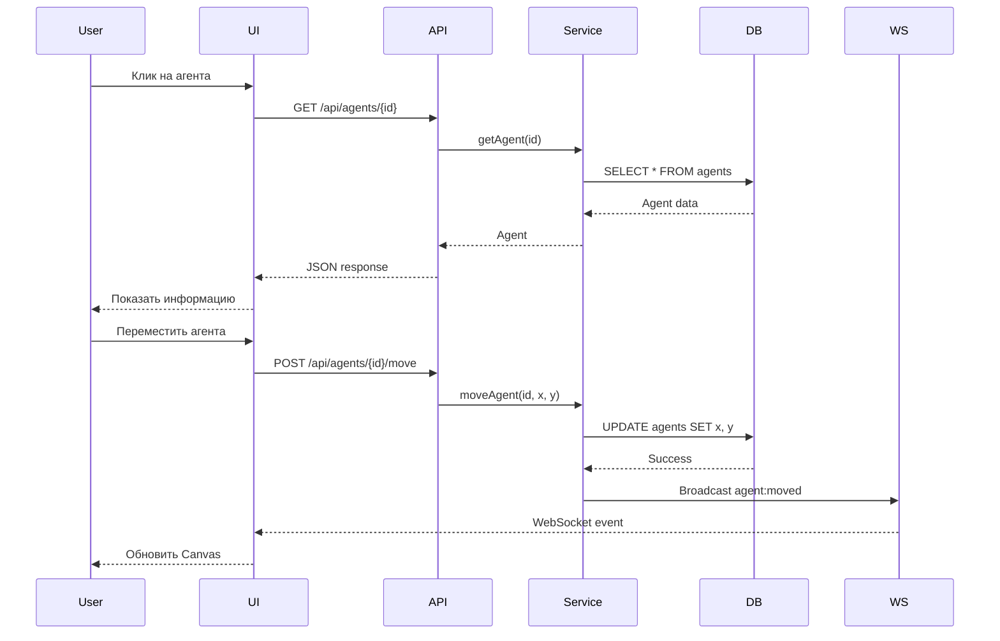
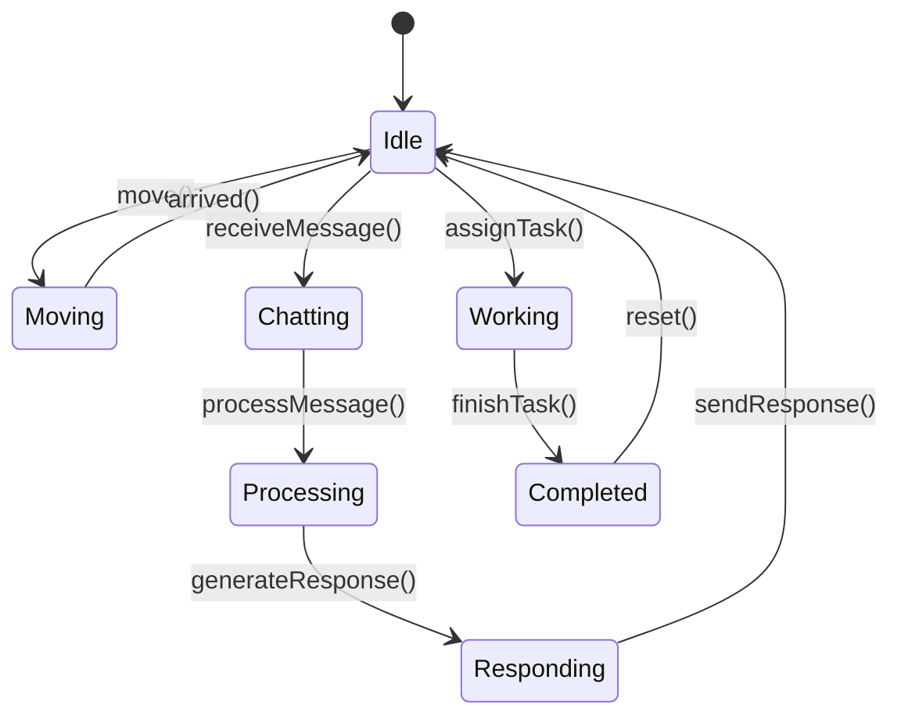

# 🏗️ Фаза 2: Архитектурная документация

**Агент**: @software-architect  
**Дата**: 2026-03-31  
**Статус**: ✅ Завершено

---

## 📋 Обзор

Архитектурная документация для 2D виртуального офиса с пиксельными агентами. Описывает высокоуровневую архитектуру, паттерны проектирования, trade-offs и best practices.

---

## 🎯 Архитектурные принципы

### 1. Разделение ответственности (SRP)
- Каждый компонент отвечает за одну задачу
- Controllers — только HTTP логика
- Services — бизнес-логика
- Models — данные и связи

### 2. Инверсия зависимостей (DIP)
- Зависимости от абстракций, а не от реализаций
- Использование интерфейсов для сервисов
- Dependency Injection через контейнер

### 3. Открытость/Закрытость (OCP)
- Система открыта для расширения, закрыта для модификации
- Использование паттернов Strategy и Observer
- Плагинная архитектура для агентов

### 4. Принцип наименьшего знания (LoD)
- Компоненты знают только о своих ближайших соседях
- Минимизация связей между модулями
- Использование посредников (Mediator pattern)

---

## 🏗️ Высокоуровневая архитектура



---

## 📊 Слои архитектуры

### 1. Presentation Layer (UI)
**Ответственность**: Отображение данных и взаимодействие с пользователем

**Компоненты**:
- Blade шаблоны
- Livewire компоненты
- JavaScript (Alpine.js)
- CSS (Tailwind)
- HTML5 Canvas

**Принципы**:
- Тонкий слой — только отображение
- Нет бизнес-логики
- Использование данных из Application Layer

### 2. Application Layer (Контроллеры)
**Ответственность**: Обработка HTTP запросов и координация

**Компоненты**:
- HTTP Controllers
- Livewire Components
- Event Listeners
- Middleware

**Принципы**:
- Валидация входных данных
- Вызов сервисов
- Формирование ответов
- Обработка ошибок

### 3. Domain Layer (Бизнес-логика)
**Ответственность**: Бизнес-правила и логика приложения

**Компоненты**:
- Services (AgentService, TaskService, OfficeService)
- Models (Agent, Task, Category, OfficeZone)
- Value Objects (Position, Status, Priority)
- Domain Events

**Принципы**:
- Чистая бизнес-логика
- Нет зависимостей от инфраструктуры
- Тестируемость
- Иммутабельность где возможно

### 4. Infrastructure Layer (Инфраструктура)
**Ответственность**: Техническая реализация

**Компоненты**:
- Database (PostgreSQL)
- Cache (Redis)
- Queue (Laravel Horizon)
- Storage (Local/S3)
- External APIs (OpenAI)

**Принципы**:
- Реализация интерфейсов из Domain Layer
- Конфигурация через environment
- Логирование и мониторинг

---

## 🎨 Паттерны проектирования

### 1. Repository Pattern
```php
<?php

namespace App\Repositories;

use App\Models\Agent;
use App\Interfaces\AgentRepositoryInterface;

class AgentRepository implements AgentRepositoryInterface
{
    public function findById(int $id): ?Agent
    {
        return Agent::find($id);
    }

    public function findAll(array $filters = []): \Illuminate\Database\Eloquent\Collection
    {
        $query = Agent::query();

        if (isset($filters['category_id'])) {
            $query->where('category_id', $filters['category_id']);
        }

        if (isset($filters['zone_id'])) {
            $query->where('zone_id', $filters['zone_id']);
        }

        if (isset($filters['is_active'])) {
            $query->where('is_active', $filters['is_active']);
        }

        return $query->get();
    }

    public function create(array $data): Agent
    {
        return Agent::create($data);
    }

    public function update(int $id, array $data): bool
    {
        return Agent::where('id', $id)->update($data);
    }

    public function delete(int $id): bool
    {
        return Agent::where('id', $id)->delete();
    }
}
```

### 2. Service Pattern
```php
<?php

namespace App\Services;

use App\Interfaces\AgentRepositoryInterface;
use App\Events\AgentMoved;

class AgentService
{
    public function __construct(
        private AgentRepositoryInterface $agentRepository,
        private OpenAIService $openAIService
    ) {}

    public function moveAgent(int $agentId, int $x, int $y): bool
    {
        $agent = $this->agentRepository->findById($agentId);

        if (!$agent) {
            throw new \Exception('Agent not found');
        }

        if ($x < 0 || $x > 800 || $y < 0 || $y > 600) {
            throw new \Exception('Invalid coordinates');
        }

        $this->agentRepository->update($agentId, [
            'x_position' => $x,
            'y_position' => $y,
        ]);

        event(new AgentMoved($agent, $x, $y));

        return true;
    }

    public function chatWithAgent(int $agentId, string $message): string
    {
        $agent = $this->agentRepository->findById($agentId);

        if (!$agent) {
            throw new \Exception('Agent not found');
        }

        $config = $agent->configs()->where('config_key', 'personality')->first();
        $personality = $config ? $config->config_value : [];

        $response = $this->openAIService->chat($personality, $message);

        return $response;
    }
}
```

### 3. Observer Pattern
```php
<?php

namespace App\Events;

use App\Models\Agent;
use Illuminate\Foundation\Events\Dispatchable;
use Illuminate\Queue\SerializesModels;

class AgentMoved
{
    use Dispatchable, SerializesModels;

    public function __construct(
        public Agent $agent,
        public int $x,
        public int $y
    ) {}
}

// Listener
<?php

namespace App\Listeners;

use App\Events\AgentMoved;
use App\Services\WebSocketService;

class BroadcastAgentMovement
{
    public function __construct(
        private WebSocketService $webSocketService
    ) {}

    public function handle(AgentMoved $event): void
    {
        $this->webSocketService->broadcast('agent:moved', [
            'agent_id' => $event->agent->id,
            'x' => $event->x,
            'y' => $event->y,
            'timestamp' => now()->toISOString(),
        ]);
    }
}
```

### 4. Strategy Pattern
```php
<?php

namespace App\Services\AgentBehavior;

interface BehaviorStrategy
{
    public function execute(Agent $agent): void;
}

class IdleBehavior implements BehaviorStrategy
{
    public function execute(Agent $agent): void
    {
        // Агент стоит на месте
    }
}

class WanderBehavior implements BehaviorStrategy
{
    public function execute(Agent $agent): void
    {
        // Агент случайно перемещается
        $x = rand(0, 800);
        $y = rand(0, 600);
        $agent->update(['x_position' => $x, 'y_position' => $y]);
    }
}

class WorkBehavior implements BehaviorStrategy
{
    public function execute(Agent $agent): void
    {
        // Агент выполняет задачу
        $task = $agent->tasks()->where('status', 'in_progress')->first();
        if ($task) {
            // Выполнить логику задачи
        }
    }
}
```

### 5. Factory Pattern
```php
<?php

namespace App\Factories;

use App\Models\Agent;
use App\Services\AgentBehavior\BehaviorStrategy;

class AgentBehaviorFactory
{
    public static function create(string $type): BehaviorStrategy
    {
        return match($type) {
            'idle' => new IdleBehavior(),
            'wander' => new WanderBehavior(),
            'work' => new WorkBehavior(),
            default => new IdleBehavior(),
        };
    }
}
```

---

## 🔐 Архитектура безопасности

### 1. Аутентификация
```php
// JWT-based аутентификация через Laravel Sanctum
Route::middleware('auth:sanctum')->group(function () {
    Route::apiResource('agents', AgentController::class);
    Route::apiResource('tasks', TaskController::class);
});
```

### 2. Авторизация
```php
// Policy-based авторизация
class AgentPolicy
{
    public function view(User $user, Agent $agent): bool
    {
        return $user->role === 'admin' || $user->role === 'user';
    }

    public function update(User $user, Agent $agent): bool
    {
        return $user->role === 'admin';
    }

    public function delete(User $user, Agent $agent): bool
    {
        return $user->role === 'admin';
    }
}
```

### 3. Валидация
```php
// Form Request валидация
class MoveAgentRequest extends FormRequest
{
    public function rules(): array
    {
        return [
            'x' => 'required|integer|min:0|max:800',
            'y' => 'required|integer|min:0|max:600',
        ];
    }
}
```

### 4. Rate Limiting
```php
// Rate limiting через middleware
Route::middleware('throttle:60,1')->group(function () {
    Route::post('/agents/{id}/chat', [AgentController::class, 'chat']);
});
```

---

## 📊 Архитектура производительности

### 1. Кэширование
```php
// Redis кэширование
class AgentService
{
    public function getAgent(int $id): ?Agent
    {
        return Cache::remember("agent:{$id}", 3600, function () use ($id) {
            return $this->agentRepository->findById($id);
        });
    }

    public function getAllAgents(): Collection
    {
        return Cache::remember('agents:all', 3600, function () {
            return $this->agentRepository->findAll();
        });
    }
}
```

### 2. Очереди
```php
// Асинхронная обработка через очереди
class ProcessAgentTask implements ShouldQueue
{
    use Dispatchable, InteractsWithQueue, Queueable, SerializesModels;

    public function __construct(
        private Task $task
    ) {}

    public function handle(): void
    {
        // Выполнить тяжелую операцию
        $this->task->update(['status' => 'completed']);
    }
}
```

### 3. Оптимизация запросов
```php
// Eager loading для избежания N+1
$agents = Agent::with(['category', 'zone', 'configs'])->get();

// Select только нужных полей
$agents = Agent::select('id', 'name', 'slug', 'x_position', 'y_position')->get();

// Индексы для частых запросов
Schema::table('agents', function (Blueprint $table) {
    $table->index(['category_id', 'is_active']);
    $table->index(['zone_id', 'is_active']);
    $table->index(['x_position', 'y_position']);
});
```

---

## 🔄 Архитектура событий

### 1. Domain Events
```php
// События домена
class AgentMoved
{
    public function __construct(
        public Agent $agent,
        public int $x,
        public int $y
    ) {}
}

class TaskCreated
{
    public function __construct(
        public Task $task
    ) {}
}

class MessageSent
{
    public function __construct(
        public Message $message
    ) {}
}
```

### 2. Event Listeners
```php
// Слушатели событий
class BroadcastAgentMovement
{
    public function handle(AgentMoved $event): void
    {
        // Отправить через WebSocket
        broadcast(new AgentMovedBroadcast($event->agent, $event->x, $event->y));
    }
}

class LogTaskCreation
{
    public function handle(TaskCreated $event): void
    {
        // Логировать создание задачи
        Log::info('Task created', ['task_id' => $event->task->id]);
    }
}
```

### 3. Event Broadcasting
```php
// Broadcasting событий
class AgentMovedBroadcast implements ShouldBroadcast
{
    public function __construct(
        private Agent $agent,
        private int $x,
        private int $y
    ) {}

    public function broadcastOn(): array
    {
        return ['office'];
    }

    public function broadcastAs(): string
    {
        return 'agent:moved';
    }

    public function broadcastWith(): array
    {
        return [
            'agent_id' => $this->agent->id,
            'x' => $this->x,
            'y' => $this->y,
        ];
    }
}
```

---

## 📊 Архитектура мониторинга

### 1. Логирование
```php
// Централизованное логирование
Log::info('Agent moved', [
    'agent_id' => $agent->id,
    'from' => ['x' => $oldX, 'y' => $oldY],
    'to' => ['x' => $newX, 'y' => $newY],
]);

Log::error('Agent move failed', [
    'agent_id' => $agent->id,
    'error' => $e->getMessage(),
]);
```

### 2. Метрики
```php
// Prometheus метрики
$agentMoves = Counter::build()
    ->name('agent_moves_total')
    ->help('Total agent moves')
    ->register();

$agentMoves->inc();
```

### 3. Health Checks
```php
// Health check endpoint
Route::get('/health', function () {
    return response()->json([
        'status' => 'ok',
        'database' => DB::connection()->getPdo() ? 'connected' : 'disconnected',
        'redis' => Redis::ping() ? 'connected' : 'disconnected',
        'timestamp' => now()->toISOString(),
    ]);
});
```

---

## 🎯 Trade-offs и решения

### 1. SQL vs NoSQL
**Выбор**: PostgreSQL (SQL)  
**Причины**:
- ACID транзакции для целостности данных
- Сложные запросы с JOIN
- JSONB для гибких данных (конфигурации)
- Зрелая экосистема

**Trade-off**: Менее гибкая схема, чем у NoSQL

### 2. Monolith vs Microservices
**Выбор**: Модульный монолит  
**Причины**:
- Проще разработка и деплой
- Меньше накладных расходов
- Легче отладка
- Достаточно для текущего масштаба

**Trade-off**: Сложнее масштабировать отдельные компоненты

### 3. REST vs GraphQL
**Выбор**: REST API  
**Причины**:
- Проще кэширование
- Лучше для CRUD операций
- Широкая поддержка инструментов
- Меньше сложности

**Trade-off**: Over-fetching для сложных запросов

### 4. Sync vs Async
**Выбор**: Гибридный подход  
**Причины**:
- Синхронные операции для простых CRUD
- Асинхронные для тяжелых задач (AI, уведомления)
- Очереди для фоновой обработки

**Trade-off**: Сложнее отладка асинхронного кода

---

## 📚 Best Practices

### 1. Код
- PSR-12 coding standard
- Type hints для всех параметров и возвращаемых значений
- Docblocks для публичных методов
- Короткие методы (< 20 строк)
- Одна ответственность на класс

### 2. Тестирование
- Unit тесты для сервисов
- Feature тесты для контроллеров
- Integration тесты для API
- Покрытие > 80%

### 3. Безопасность
- Валидация всех входных данных
- Экранирование выходных данных
- Параметризованные запросы
- HTTPS для всех соединений
- Rate limiting для API

### 4. Производительность
- Кэширование частых запросов
- Eager loading для связей
- Индексы для поиска
- Очереди для тяжелых задач
- Мониторинг производительности

---

## 📊 Диаграммы

### 1. Диаграмма компонентов


### 2. Диаграмма последовательности


### 3. Диаграмма состояний


---

## 📚 Дополнительные ресурсы

- [API спецификация](PHASE2_API_SPECIFICATION.md)
- [Дизайн-система](PHASE2_DESIGN_SYSTEM.md)
- [Схема базы данных](PHASE2_DATABASE_SCHEMA.md)
- [Отчёт об аудите](PHASE1_AUDIT_REPORT.md)
- [Техническое задание](PHASE1_TECHNICAL_SPECIFICATION.md)

---

**Создано**: 2026-03-31  
**Агент**: @software-architect  
**Статус**: ✅ Завершено
