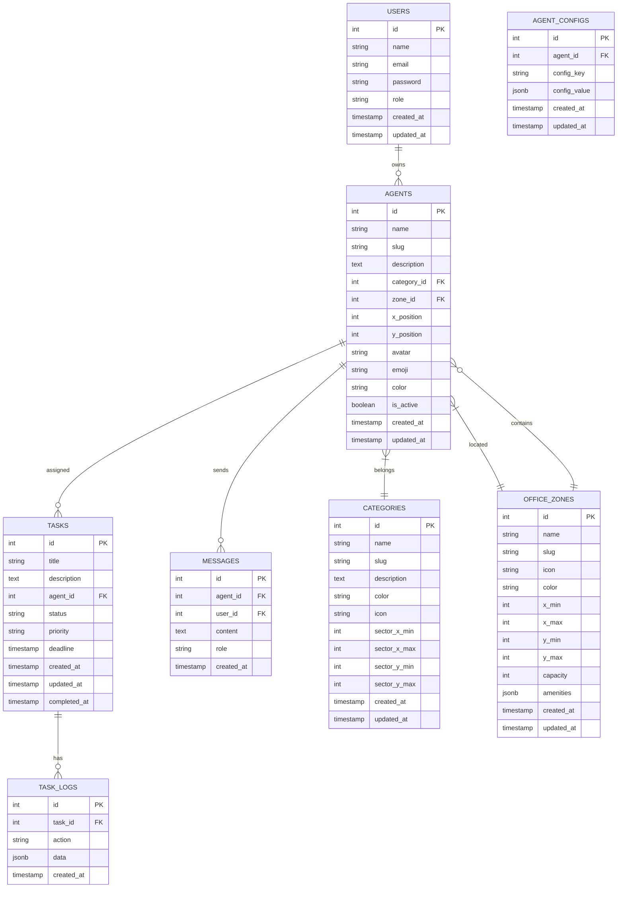

# 🗄️ Фаза 2: Схема базы данных

**Агент**: @database-optimizer  
**Дата**: 2026-03-31  
**Статус**: ✅ Завершено

---

## 📋 Обзор

Схема базы данных для 2D виртуального офиса с пиксельными агентами. Включает таблицы для агентов, категорий, офисных зон, задач, сообщений и конфигураций.

**База данных**: PostgreSQL 15+  
**Кодировка**: UTF-8  
**Collation**: en_US.UTF-8

---

## 📊 Диаграмма базы данных



---

## 📋 Таблицы

### 1. users
```sql
CREATE TABLE users (
    id SERIAL PRIMARY KEY,
    name VARCHAR(255) NOT NULL,
    email VARCHAR(255) UNIQUE NOT NULL,
    email_verified_at TIMESTAMP NULL,
    password VARCHAR(255) NOT NULL,
    role VARCHAR(50) NOT NULL DEFAULT 'user' CHECK (role IN ('admin', 'user', 'viewer')),
    remember_token VARCHAR(100) NULL,
    created_at TIMESTAMP DEFAULT NOW(),
    updated_at TIMESTAMP DEFAULT NOW()
);

-- Индексы
CREATE INDEX idx_users_email ON users(email);
CREATE INDEX idx_users_role ON users(role);

-- Комментарии
COMMENT ON TABLE users IS 'Пользователи системы';
COMMENT ON COLUMN users.role IS 'Роль пользователя: admin, user, viewer';
```

### 2. categories
```sql
CREATE TABLE categories (
    id SERIAL PRIMARY KEY,
    name VARCHAR(255) NOT NULL,
    slug VARCHAR(255) UNIQUE NOT NULL,
    description TEXT,
    color VARCHAR(7) NOT NULL,
    icon VARCHAR(10) NOT NULL,
    sector_x_min INTEGER NOT NULL,
    sector_x_max INTEGER NOT NULL,
    sector_y_min INTEGER NOT NULL,
    sector_y_max INTEGER NOT NULL,
    created_at TIMESTAMP DEFAULT NOW(),
    updated_at TIMESTAMP DEFAULT NOW()
);

-- Индексы
CREATE INDEX idx_categories_slug ON categories(slug);
CREATE INDEX idx_categories_name ON categories(name);

-- Комментарии
COMMENT ON TABLE categories IS 'Категории агентов';
COMMENT ON COLUMN categories.slug IS 'Уникальный slug для URL';
COMMENT ON COLUMN categories.color IS 'HEX цвет категории';
COMMENT ON COLUMN categories.icon IS 'Эмодзи иконка';
COMMENT ON COLUMN categories.sector_x_min IS 'Минимальная X координата сектора';
COMMENT ON COLUMN categories.sector_x_max IS 'Максимальная X координата сектора';
COMMENT ON COLUMN categories.sector_y_min IS 'Минимальная Y координата сектора';
COMMENT ON COLUMN categories.sector_y_max IS 'Максимальная Y координата сектора';
```

### 3. office_zones
```sql
CREATE TABLE office_zones (
    id SERIAL PRIMARY KEY,
    name VARCHAR(255) NOT NULL,
    slug VARCHAR(255) UNIQUE NOT NULL,
    icon VARCHAR(10) NOT NULL,
    color VARCHAR(7) NOT NULL,
    x_min INTEGER NOT NULL,
    x_max INTEGER NOT NULL,
    y_min INTEGER NOT NULL,
    y_max INTEGER NOT NULL,
    capacity INTEGER NOT NULL DEFAULT 10,
    amenities JSONB NOT NULL DEFAULT '[]',
    created_at TIMESTAMP DEFAULT NOW(),
    updated_at TIMESTAMP DEFAULT NOW()
);

-- Индексы
CREATE INDEX idx_office_zones_slug ON office_zones(slug);
CREATE INDEX idx_office_zones_name ON office_zones(name);

-- Ограничения
ALTER TABLE office_zones ADD CONSTRAINT check_x_range CHECK (x_min < x_max);
ALTER TABLE office_zones ADD CONSTRAINT check_y_range CHECK (y_min < y_max);
ALTER TABLE office_zones ADD CONSTRAINT check_capacity CHECK (capacity > 0);

-- Комментарии
COMMENT ON TABLE office_zones IS 'Офисные зоны';
COMMENT ON COLUMN office_zones.slug IS 'Уникальный slug для URL';
COMMENT ON COLUMN office_zones.icon IS 'Эмодзи иконка';
COMMENT ON COLUMN office_zones.color IS 'HEX цвет зоны';
COMMENT ON COLUMN office_zones.x_min IS 'Минимальная X координата';
COMMENT ON COLUMN office_zones.x_max IS 'Максимальная X координата';
COMMENT ON COLUMN office_zones.y_min IS 'Минимальная Y координата';
COMMENT ON COLUMN office_zones.y_max IS 'Максимальная Y координата';
COMMENT ON COLUMN office_zones.capacity IS 'Вместимость зоны';
COMMENT ON COLUMN office_zones.amenities IS 'JSON массив удобств';
```

### 4. agents
```sql
CREATE TABLE agents (
    id SERIAL PRIMARY KEY,
    name VARCHAR(255) NOT NULL,
    slug VARCHAR(255) UNIQUE NOT NULL,
    description TEXT,
    category_id INTEGER NOT NULL REFERENCES categories(id) ON DELETE CASCADE,
    zone_id INTEGER NOT NULL REFERENCES office_zones(id) ON DELETE CASCADE,
    x_position INTEGER NOT NULL DEFAULT 0,
    y_position INTEGER NOT NULL DEFAULT 0,
    avatar VARCHAR(500) NULL,
    emoji VARCHAR(10) NULL,
    color VARCHAR(7) NULL,
    is_active BOOLEAN NOT NULL DEFAULT true,
    source_file VARCHAR(500) NULL,
    created_at TIMESTAMP DEFAULT NOW(),
    updated_at TIMESTAMP DEFAULT NOW()
);

-- Индексы
CREATE INDEX idx_agents_slug ON agents(slug);
CREATE INDEX idx_agents_name ON agents(name);
CREATE INDEX idx_agents_category_id ON agents(category_id);
CREATE INDEX idx_agents_zone_id ON agents(zone_id);
CREATE INDEX idx_agents_is_active ON agents(is_active);
CREATE INDEX idx_agents_position ON agents(x_position, y_position);

-- Ограничения
ALTER TABLE agents ADD CONSTRAINT check_x_position CHECK (x_position >= 0 AND x_position <= 800);
ALTER TABLE agents ADD CONSTRAINT check_y_position CHECK (y_position >= 0 AND y_position <= 600);

-- Комментарии
COMMENT ON TABLE agents IS 'Агенты системы';
COMMENT ON COLUMN agents.slug IS 'Уникальный slug для URL';
COMMENT ON COLUMN agents.category_id IS 'FK на категорию';
COMMENT ON COLUMN agents.zone_id IS 'FK на офисную зону';
COMMENT ON COLUMN agents.x_position IS 'X координата в офисе (0-800)';
COMMENT ON COLUMN agents.y_position IS 'Y координата в офисе (0-600)';
COMMENT ON COLUMN agents.avatar IS 'URL аватара';
COMMENT ON COLUMN agents.emoji IS 'Эмодзи агента';
COMMENT ON COLUMN agents.color IS 'HEX цвет агента';
COMMENT ON COLUMN agents.is_active IS 'Активен ли агент';
COMMENT ON COLUMN agents.source_file IS 'Путь к исходному файлу';
```

### 5. agent_configs
```sql
CREATE TABLE agent_configs (
    id SERIAL PRIMARY KEY,
    agent_id INTEGER NOT NULL REFERENCES agents(id) ON DELETE CASCADE,
    config_key VARCHAR(255) NOT NULL,
    config_value JSONB NOT NULL,
    created_at TIMESTAMP DEFAULT NOW(),
    updated_at TIMESTAMP DEFAULT NOW()
);

-- Индексы
CREATE INDEX idx_agent_configs_agent_id ON agent_configs(agent_id);
CREATE INDEX idx_agent_configs_key ON agent_configs(config_key);
CREATE UNIQUE INDEX idx_agent_configs_agent_key ON agent_configs(agent_id, config_key);

-- Комментарии
COMMENT ON TABLE agent_configs IS 'Конфигурации агентов';
COMMENT ON COLUMN agent_configs.agent_id IS 'FK на агента';
COMMENT ON COLUMN agent_configs.config_key IS 'Ключ конфигурации';
COMMENT ON COLUMN agent_configs.config_value IS 'JSON значение конфигурации';
```

### 6. tasks
```sql
CREATE TABLE tasks (
    id SERIAL PRIMARY KEY,
    title VARCHAR(500) NOT NULL,
    description TEXT,
    agent_id INTEGER NOT NULL REFERENCES agents(id) ON DELETE CASCADE,
    status VARCHAR(50) NOT NULL DEFAULT 'pending' CHECK (status IN ('pending', 'in_progress', 'testing', 'completed', 'failed')),
    priority VARCHAR(50) NOT NULL DEFAULT 'medium' CHECK (priority IN ('low', 'medium', 'high', 'critical')),
    deadline TIMESTAMP NULL,
    created_at TIMESTAMP DEFAULT NOW(),
    updated_at TIMESTAMP DEFAULT NOW(),
    completed_at TIMESTAMP NULL
);

-- Индексы
CREATE INDEX idx_tasks_agent_id ON tasks(agent_id);
CREATE INDEX idx_tasks_status ON tasks(status);
CREATE INDEX idx_tasks_priority ON tasks(priority);
CREATE INDEX idx_tasks_deadline ON tasks(deadline);
CREATE INDEX idx_tasks_created_at ON tasks(created_at);

-- Комментарии
COMMENT ON TABLE tasks IS 'Задачи агентов';
COMMENT ON COLUMN tasks.agent_id IS 'FK на агента';
COMMENT ON COLUMN tasks.status IS 'Статус: pending, in_progress, testing, completed, failed';
COMMENT ON COLUMN tasks.priority IS 'Приоритет: low, medium, high, critical';
COMMENT ON COLUMN tasks.deadline IS 'Дедлайн задачи';
COMMENT ON COLUMN tasks.completed_at IS 'Время завершения';
```

### 7. task_logs
```sql
CREATE TABLE task_logs (
    id SERIAL PRIMARY KEY,
    task_id INTEGER NOT NULL REFERENCES tasks(id) ON DELETE CASCADE,
    action VARCHAR(255) NOT NULL,
    data JSONB NULL,
    created_at TIMESTAMP DEFAULT NOW()
);

-- Индексы
CREATE INDEX idx_task_logs_task_id ON task_logs(task_id);
CREATE INDEX idx_task_logs_action ON task_logs(action);
CREATE INDEX idx_task_logs_created_at ON task_logs(created_at);

-- Комментарии
COMMENT ON TABLE task_logs IS 'Логи задач';
COMMENT ON COLUMN task_logs.task_id IS 'FK на задачу';
COMMENT ON COLUMN task_logs.action IS 'Действие';
COMMENT ON COLUMN task_logs.data IS 'JSON данные действия';
```

### 8. messages
```sql
CREATE TABLE messages (
    id SERIAL PRIMARY KEY,
    agent_id INTEGER NOT NULL REFERENCES agents(id) ON DELETE CASCADE,
    user_id INTEGER NOT NULL REFERENCES users(id) ON DELETE CASCADE,
    content TEXT NOT NULL,
    role VARCHAR(50) NOT NULL CHECK (role IN ('user', 'agent')),
    created_at TIMESTAMP DEFAULT NOW()
);

-- Индексы
CREATE INDEX idx_messages_agent_id ON messages(agent_id);
CREATE INDEX idx_messages_user_id ON messages(user_id);
CREATE INDEX idx_messages_role ON messages(role);
CREATE INDEX idx_messages_created_at ON messages(created_at);

-- Комментарии
COMMENT ON TABLE messages IS 'Сообщения между пользователями и агентами';
COMMENT ON COLUMN messages.agent_id IS 'FK на агента';
COMMENT ON COLUMN messages.user_id IS 'FK на пользователя';
COMMENT ON COLUMN messages.content IS 'Текст сообщения';
COMMENT ON COLUMN messages.role IS 'Роль: user, agent';
```

---

## 📊 Представления (Views)

### 1. agents_with_details
```sql
CREATE VIEW agents_with_details AS
SELECT 
    a.id,
    a.name,
    a.slug,
    a.description,
    a.x_position,
    a.y_position,
    a.avatar,
    a.emoji,
    a.color,
    a.is_active,
    c.name AS category_name,
    c.slug AS category_slug,
    c.color AS category_color,
    c.icon AS category_icon,
    oz.name AS zone_name,
    oz.slug AS zone_slug,
    oz.icon AS zone_icon,
    oz.color AS zone_color,
    a.created_at,
    a.updated_at
FROM agents a
LEFT JOIN categories c ON a.category_id = c.id
LEFT JOIN office_zones oz ON a.zone_id = oz.id;

COMMENT ON VIEW agents_with_details IS 'Агенты с деталями категорий и зон';
```

### 2. tasks_with_agent
```sql
CREATE VIEW tasks_with_agent AS
SELECT 
    t.id,
    t.title,
    t.description,
    t.status,
    t.priority,
    t.deadline,
    t.created_at,
    t.updated_at,
    t.completed_at,
    a.name AS agent_name,
    a.slug AS agent_slug,
    a.emoji AS agent_emoji,
    c.name AS category_name,
    c.color AS category_color
FROM tasks t
LEFT JOIN agents a ON t.agent_id = a.id
LEFT JOIN categories c ON a.category_id = c.id;

COMMENT ON VIEW tasks_with_agent IS 'Задачи с информацией об агентах';
```

### 3. messages_with_details
```sql
CREATE VIEW messages_with_details AS
SELECT 
    m.id,
    m.content,
    m.role,
    m.created_at,
    a.name AS agent_name,
    a.slug AS agent_slug,
    a.emoji AS agent_emoji,
    u.name AS user_name,
    u.email AS user_email
FROM messages m
LEFT JOIN agents a ON m.agent_id = a.id
LEFT JOIN users u ON m.user_id = u.id;

COMMENT ON VIEW messages_with_details IS 'Сообщения с деталями агентов и пользователей';
```

### 4. office_stats
```sql
CREATE VIEW office_stats AS
SELECT 
    (SELECT COUNT(*) FROM agents WHERE is_active = true) AS active_agents,
    (SELECT COUNT(*) FROM agents) AS total_agents,
    (SELECT COUNT(*) FROM tasks WHERE status = 'pending') AS pending_tasks,
    (SELECT COUNT(*) FROM tasks WHERE status = 'in_progress') AS in_progress_tasks,
    (SELECT COUNT(*) FROM tasks WHERE status = 'completed') AS completed_tasks,
    (SELECT COUNT(*) FROM messages) AS total_messages,
    (SELECT COUNT(*) FROM users) AS total_users;

COMMENT ON VIEW office_stats IS 'Статистика офиса';
```

---

## 📊 Функции

### 1. get_agents_in_zone
```sql
CREATE OR REPLACE FUNCTION get_agents_in_zone(zone_id INTEGER)
RETURNS TABLE (
    id INTEGER,
    name VARCHAR(255),
    slug VARCHAR(255),
    x_position INTEGER,
    y_position INTEGER,
    emoji VARCHAR(10),
    category_name VARCHAR(255)
) AS $$
BEGIN
    RETURN QUERY
    SELECT 
        a.id,
        a.name,
        a.slug,
        a.x_position,
        a.y_position,
        a.emoji,
        c.name AS category_name
    FROM agents a
    LEFT JOIN categories c ON a.category_id = c.id
    WHERE a.zone_id = $1 AND a.is_active = true;
END;
$$ LANGUAGE plpgsql;

COMMENT ON FUNCTION get_agents_in_zone IS 'Получить агентов в зоне';
```

### 2. get_agents_in_category
```sql
CREATE OR REPLACE FUNCTION get_agents_in_category(category_id INTEGER)
RETURNS TABLE (
    id INTEGER,
    name VARCHAR(255),
    slug VARCHAR(255),
    x_position INTEGER,
    y_position INTEGER,
    emoji VARCHAR(10),
    zone_name VARCHAR(255)
) AS $$
BEGIN
    RETURN QUERY
    SELECT 
        a.id,
        a.name,
        a.slug,
        a.x_position,
        a.y_position,
        a.emoji,
        oz.name AS zone_name
    FROM agents a
    LEFT JOIN office_zones oz ON a.zone_id = oz.id
    WHERE a.category_id = $1 AND a.is_active = true;
END;
$$ LANGUAGE plpgsql;

COMMENT ON FUNCTION get_agents_in_category IS 'Получить агентов в категории';
```

### 3. move_agent
```sql
CREATE OR REPLACE FUNCTION move_agent(agent_id INTEGER, new_x INTEGER, new_y INTEGER)
RETURNS BOOLEAN AS $$
DECLARE
    agent_exists BOOLEAN;
BEGIN
    -- Проверить существование агента
    SELECT EXISTS(SELECT 1 FROM agents WHERE id = $1) INTO agent_exists;
    
    IF NOT agent_exists THEN
        RETURN FALSE;
    END IF;
    
    -- Проверить границы
    IF $2 < 0 OR $2 > 800 OR $3 < 0 OR $3 > 600 THEN
        RETURN FALSE;
    END IF;
    
    -- Обновить позицию
    UPDATE agents 
    SET x_position = $2, y_position = $3, updated_at = NOW()
    WHERE id = $1;
    
    RETURN TRUE;
END;
$$ LANGUAGE plpgsql;

COMMENT ON FUNCTION move_agent IS 'Переместить агента';
```

### 4. get_office_heatmap
```sql
CREATE OR REPLACE FUNCTION get_office_heatmap()
RETURNS TABLE (
    x INTEGER,
    y INTEGER,
    agent_count BIGINT
) AS $$
BEGIN
    RETURN QUERY
    SELECT 
        (x_position / 50) * 50 AS x,
        (y_position / 50) * 50 AS y,
        COUNT(*) AS agent_count
    FROM agents
    WHERE is_active = true
    GROUP BY (x_position / 50), (y_position / 50)
    ORDER BY agent_count DESC;
END;
$$ LANGUAGE plpgsql;

COMMENT ON FUNCTION get_office_heatmap IS 'Получить тепловую карту офиса';
```

---

## 📊 Триггеры

### 1. update_updated_at
```sql
CREATE OR REPLACE FUNCTION update_updated_at()
RETURNS TRIGGER AS $$
BEGIN
    NEW.updated_at = NOW();
    RETURN NEW;
END;
$$ LANGUAGE plpgsql;

-- Применить триггер к таблицам
CREATE TRIGGER trigger_users_updated_at
    BEFORE UPDATE ON users
    FOR EACH ROW
    EXECUTE FUNCTION update_updated_at();

CREATE TRIGGER trigger_agents_updated_at
    BEFORE UPDATE ON agents
    FOR EACH ROW
    EXECUTE FUNCTION update_updated_at();

CREATE TRIGGER trigger_categories_updated_at
    BEFORE UPDATE ON categories
    FOR EACH ROW
    EXECUTE FUNCTION update_updated_at();

CREATE TRIGGER trigger_office_zones_updated_at
    BEFORE UPDATE ON office_zones
    FOR EACH ROW
    EXECUTE FUNCTION update_updated_at();

CREATE TRIGGER trigger_tasks_updated_at
    BEFORE UPDATE ON tasks
    FOR EACH ROW
    EXECUTE FUNCTION update_updated_at();

CREATE TRIGGER trigger_agent_configs_updated_at
    BEFORE UPDATE ON agent_configs
    FOR EACH ROW
    EXECUTE FUNCTION update_updated_at();
```

### 2. log_task_status_change
```sql
CREATE OR REPLACE FUNCTION log_task_status_change()
RETURNS TRIGGER AS $$
BEGIN
    IF OLD.status != NEW.status THEN
        INSERT INTO task_logs (task_id, action, data)
        VALUES (
            NEW.id,
            'status_changed',
            jsonb_build_object(
                'from', OLD.status,
                'to', NEW.status,
                'timestamp', NOW()
            )
        );
    END IF;
    
    IF NEW.status = 'completed' AND OLD.status != 'completed' THEN
        NEW.completed_at = NOW();
    END IF;
    
    RETURN NEW;
END;
$$ LANGUAGE plpgsql;

CREATE TRIGGER trigger_task_status_change
    BEFORE UPDATE ON tasks
    FOR EACH ROW
    EXECUTE FUNCTION log_task_status_change();
```

---

## 📊 Начальные данные

### 1. Категории
```sql
INSERT INTO categories (name, slug, description, color, icon, sector_x_min, sector_x_max, sector_y_min, sector_y_max) VALUES
('Academic', 'academic', 'Academic and research specialists', '#3498DB', '📚', 0, 150, 0, 200),
('Design', 'design', 'UI/UX and visual design specialists', '#9B59B6', '🎨', 160, 310, 0, 200),
('Engineering', 'engineering', 'Software development and architecture', '#2ECC71', '⚙️', 320, 470, 0, 200),
('Game Development', 'game-development', 'Game design and development', '#E74C3C', '🎮', 480, 600, 0, 200),
('Marketing', 'marketing', 'Marketing and growth specialists', '#E84393', '📢', 0, 150, 210, 400),
('Paid Media', 'paid-media', 'Paid advertising specialists', '#F1C40F', '💰', 160, 310, 210, 400),
('Product', 'product', 'Product management and strategy', '#6366F1', '📦', 320, 470, 210, 400),
('Project Management', 'project-management', 'Project coordination and delivery', '#008080', '📋', 480, 600, 210, 400),
('Sales', 'sales', 'Sales and business development', '#F39C12', '💼', 0, 200, 0, 150),
('Spatial Computing', 'spatial-computing', 'AR/VR and spatial technology', '#84CC16', '🖥️', 0, 200, 160, 300),
('Specialized', 'specialized', 'Specialized domain experts', '#06B6D4', '🔧', 210, 400, 0, 150),
('Support', 'support', 'Support and operations', '#6B7280', '🛟', 410, 600, 0, 150);
```

### 2. Офисные зоны
```sql
INSERT INTO office_zones (name, slug, icon, color, x_min, x_max, y_min, y_max, capacity, amenities) VALUES
('Рабочая зона', 'workspace', '💼', '#e3f2fd', 0, 600, 0, 400, 50, '["desks", "monitors", "chairs", "power_outlets"]'),
('Переговорная', 'meeting_room', '🤝', '#fff3e0', 620, 800, 0, 200, 12, '["conference_table", "whiteboard", "projector", "video_conf"]'),
('Зона мозгового штурма', 'brainstorm', '💡', '#f3e5f5', 620, 800, 220, 400, 15, '["whiteboards", "sticky_notes", "markers", "comfortable_seating"]'),
('Зона отдыха', 'break_room', '🛋️', '#e8f5e9', 0, 300, 420, 580, 20, '["sofas", "plants", "games", "relaxation_area"]'),
('Столовая', 'cafeteria', '🍽️', '#fff8e1', 320, 600, 420, 580, 30, '["tables", "vending_machines", "microwave", "refrigerator"]'),
('Лаунж', 'lounge', '☕', '#fce4ec', 620, 800, 420, 580, 15, '["coffee_machine", "comfortable_chairs", "magazines", "quiet_area"]');
```

### 3. Администратор
```sql
INSERT INTO users (name, email, password, role) VALUES
('Keks', 'keks@glf.no', '$2y$10$92IXUNpkjO0rOQ5byMi.Ye4oKoEa3Ro9llC/.og/at2.uheWG/igi', 'admin');
-- Пароль: 6636
```

---

## 📊 Миграции Laravel

### 1. create_users_table
```php
<?php

use Illuminate\Database\Migrations\Migration;
use Illuminate\Database\Schema\Blueprint;
use Illuminate\Support\Facades\Schema;

return new class extends Migration
{
    public function up()
    {
        Schema::create('users', function (Blueprint $table) {
            $table->id();
            $table->string('name');
            $table->string('email')->unique();
            $table->timestamp('email_verified_at')->nullable();
            $table->string('password');
            $table->enum('role', ['admin', 'user', 'viewer'])->default('user');
            $table->rememberToken();
            $table->timestamps();
        });
    }

    public function down()
    {
        Schema::dropIfExists('users');
    }
};
```

### 2. create_categories_table
```php
<?php

use Illuminate\Database\Migrations\Migration;
use Illuminate\Database\Schema\Blueprint;
use Illuminate\Support\Facades\Schema;

return new class extends Migration
{
    public function up()
    {
        Schema::create('categories', function (Blueprint $table) {
            $table->id();
            $table->string('name');
            $table->string('slug')->unique();
            $table->text('description')->nullable();
            $table->string('color', 7);
            $table->string('icon', 10);
            $table->integer('sector_x_min');
            $table->integer('sector_x_max');
            $table->integer('sector_y_min');
            $table->integer('sector_y_max');
            $table->timestamps();
        });
    }

    public function down()
    {
        Schema::dropIfExists('categories');
    }
};
```

### 3. create_office_zones_table
```php
<?php

use Illuminate\Database\Migrations\Migration;
use Illuminate\Database\Schema\Blueprint;
use Illuminate\Support\Facades\Schema;

return new class extends Migration
{
    public function up()
    {
        Schema::create('office_zones', function (Blueprint $table) {
            $table->id();
            $table->string('name');
            $table->string('slug')->unique();
            $table->string('icon', 10);
            $table->string('color', 7);
            $table->integer('x_min');
            $table->integer('x_max');
            $table->integer('y_min');
            $table->integer('y_max');
            $table->integer('capacity')->default(10);
            $table->jsonb('amenities')->default('[]');
            $table->timestamps();
        });
    }

    public function down()
    {
        Schema::dropIfExists('office_zones');
    }
};
```

### 4. create_agents_table
```php
<?php

use Illuminate\Database\Migrations\Migration;
use Illuminate\Database\Schema\Blueprint;
use Illuminate\Support\Facades\Schema;

return new class extends Migration
{
    public function up()
    {
        Schema::create('agents', function (Blueprint $table) {
            $table->id();
            $table->string('name');
            $table->string('slug')->unique();
            $table->text('description')->nullable();
            $table->foreignId('category_id')->constrained()->onDelete('cascade');
            $table->foreignId('zone_id')->constrained()->onDelete('cascade');
            $table->integer('x_position')->default(0);
            $table->integer('y_position')->default(0);
            $table->string('avatar', 500)->nullable();
            $table->string('emoji', 10)->nullable();
            $table->string('color', 7)->nullable();
            $table->boolean('is_active')->default(true);
            $table->string('source_file', 500)->nullable();
            $table->timestamps();
        });
    }

    public function down()
    {
        Schema::dropIfExists('agents');
    }
};
```

### 5. create_agent_configs_table
```php
<?php

use Illuminate\Database\Migrations\Migration;
use Illuminate\Database\Schema\Blueprint;
use Illuminate\Support\Facades\Schema;

return new class extends Migration
{
    public function up()
    {
        Schema::create('agent_configs', function (Blueprint $table) {
            $table->id();
            $table->foreignId('agent_id')->constrained()->onDelete('cascade');
            $table->string('config_key');
            $table->jsonb('config_value');
            $table->timestamps();
            
            $table->unique(['agent_id', 'config_key']);
        });
    }

    public function down()
    {
        Schema::dropIfExists('agent_configs');
    }
};
```

### 6. create_tasks_table
```php
<?php

use Illuminate\Database\Migrations\Migration;
use Illuminate\Database\Schema\Blueprint;
use Illuminate\Support\Facades\Schema;

return new class extends Migration
{
    public function up()
    {
        Schema::create('tasks', function (Blueprint $table) {
            $table->id();
            $table->string('title', 500);
            $table->text('description')->nullable();
            $table->foreignId('agent_id')->constrained()->onDelete('cascade');
            $table->enum('status', ['pending', 'in_progress', 'testing', 'completed', 'failed'])->default('pending');
            $table->enum('priority', ['low', 'medium', 'high', 'critical'])->default('medium');
            $table->timestamp('deadline')->nullable();
            $table->timestamps();
            $table->timestamp('completed_at')->nullable();
        });
    }

    public function down()
    {
        Schema::dropIfExists('tasks');
    }
};
```

### 7. create_task_logs_table
```php
<?php

use Illuminate\Database\Migrations\Migration;
use Illuminate\Database\Schema\Blueprint;
use Illuminate\Support\Facades\Schema;

return new class extends Migration
{
    public function up()
    {
        Schema::create('task_logs', function (Blueprint $table) {
            $table->id();
            $table->foreignId('task_id')->constrained()->onDelete('cascade');
            $table->string('action');
            $table->jsonb('data')->nullable();
            $table->timestamps();
        });
    }

    public function down()
    {
        Schema::dropIfExists('task_logs');
    }
};
```

### 8. create_messages_table
```php
<?php

use Illuminate\Database\Migrations\Migration;
use Illuminate\Database\Schema\Blueprint;
use Illuminate\Support\Facades\Schema;

return new class extends Migration
{
    public function up()
    {
        Schema::create('messages', function (Blueprint $table) {
            $table->id();
            $table->foreignId('agent_id')->constrained()->onDelete('cascade');
            $table->foreignId('user_id')->constrained()->onDelete('cascade');
            $table->text('content');
            $table->enum('role', ['user', 'agent']);
            $table->timestamps();
        });
    }

    public function down()
    {
        Schema::dropIfExists('messages');
    }
};
```

---

## 📊 Оптимизация производительности

### Индексы для частых запросов:
```sql
-- Агенты по позиции
CREATE INDEX idx_agents_position_active ON agents(x_position, y_position) WHERE is_active = true;

-- Задачи по статусу и приоритету
CREATE INDEX idx_tasks_status_priority ON tasks(status, priority);

-- Сообщения по агенту и времени
CREATE INDEX idx_messages_agent_created ON messages(agent_id, created_at DESC);

-- Задачи по агенту и статусу
CREATE INDEX idx_tasks_agent_status ON tasks(agent_id, status);
```

### Партиционирование (для больших данных):
```sql
-- Партиционирование messages по месяцам
CREATE TABLE messages_partitioned (
    id SERIAL,
    agent_id INTEGER NOT NULL,
    user_id INTEGER NOT NULL,
    content TEXT NOT NULL,
    role VARCHAR(50) NOT NULL,
    created_at TIMESTAMP NOT NULL
) PARTITION BY RANGE (created_at);

-- Создать партиции
CREATE TABLE messages_2026_03 PARTITION OF messages_partitioned
    FOR VALUES FROM ('2026-03-01') TO ('2026-04-01');

CREATE TABLE messages_2026_04 PARTITION OF messages_partitioned
    FOR VALUES FROM ('2026-04-01') TO ('2026-05-01');
```

---

## 📊 Резервное копирование

### Ежедневный бэкап:
```bash
#!/bin/bash
# backup.sh

DATE=$(date +%Y%m%d_%H%M%S)
BACKUP_DIR="/var/backups/postgresql"
DB_NAME="bikube"

# Создать бэкап
pg_dump -U postgres -d $DB_NAME > $BACKUP_DIR/$DB_NAME_$DATE.sql

# Сжать бэкап
gzip $BACKUP_DIR/$DB_NAME_$DATE.sql

# Удалить старые бэкапы (старше 30 дней)
find $BACKUP_DIR -name "*.sql.gz" -mtime +30 -delete

echo "Backup completed: $DB_NAME_$DATE.sql.gz"
```

### Восстановление:
```bash
#!/bin/bash
# restore.sh

BACKUP_FILE=$1
DB_NAME="bikube"

# Остановить приложение
php artisan down

# Восстановить БД
gunzip -c $BACKUP_FILE | psql -U postgres -d $DB_NAME

# Запустить приложение
php artisan up

echo "Restore completed from: $BACKUP_FILE"
```

---

## 📚 Дополнительные ресурсы

- [API спецификация](PHASE2_API_SPECIFICATION.md)
- [Дизайн-система](PHASE2_DESIGN_SYSTEM.md)
- [Отчёт об аудите](PHASE1_AUDIT_REPORT.md)
- [Техническое задание](PHASE1_TECHNICAL_SPECIFICATION.md)

---

**Создано**: 2026-03-31  
**Агент**: @database-optimizer  
**Статус**: ✅ Завершено
